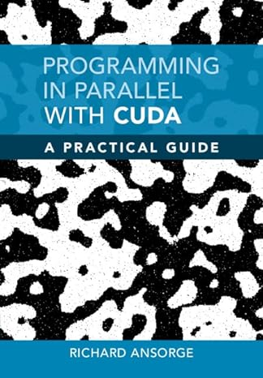

# CUDA Programs

https://github.com/RichardAns/CUDA-Programs

The above repository is from the book 'Programming in Parallel with CUDA A Practical Guide' by Richard Ansorge

This folder will contain code samples from the book 'Programming in Parallel with CUDA A Practical Guide' by Richard Ansorge. The book is available at https://www.amazon.com/Programming-Parallel-CUDA-Practical-Guide/dp/0128119861

This is the repository for my CUDA programming experiments. I am using this repository to learn CUDA programming. I am using the NVIDIA CUDA Training Series as my primary resource. I am also using the NVIDIA CUDA C++ Programming Guide as a secondary resource. I am also using the NVIDIA CUDA Samples as a tertiary resource.

(Wow! Github CoPilot generated ALL of the above text!) 

## Tuesday, September 26, 2023

So today I just noticed the example file names in the repo do not contain the chapter.exampleNumber convention used in the book, so from now on, I will prepend the chapterExampleNumber to the file name to make it easier to connect the example file with the book.

