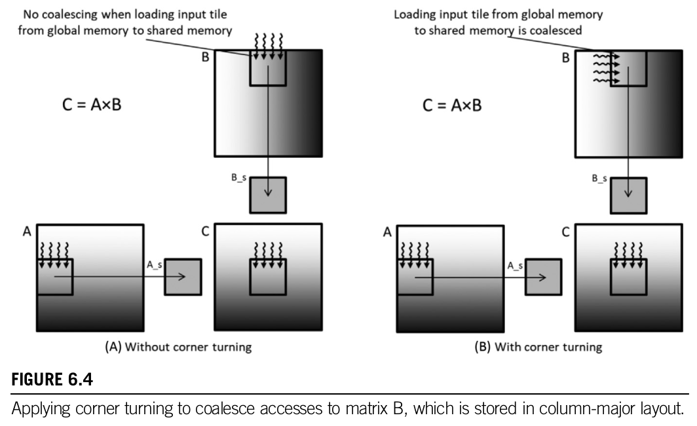

#### Sunday, June 16, 2024

"Chapter 3 Multidimensional grids and data" makes no mention of the thrust library, and yet [this](https://github.com/R100001/Programming-Massively-Parallel-Processors) repo has "Chapter 3 Scaleable Prallel Execution" which covers vector addition using the thrust library. So just because, I am going to ask ChatGPT to generate a cuda code example that demonstrates this. 

#### Friday, June 14, 2024

Got the blur image code to run. Turns out the code generated by ChatGPT actually worked, but I was setting the blur_size to too small a value for the generated image to appear blurred ... sigh. Also, setting blur_size to an even number also does not work. Chapter03/BlurImage3.cu was the code sample that works, but I am guessing BlurImage.cu and BlurImage2.cu also work ...  

#### Sunday, June 9, 2024

I think I am going to stick with [this](https://github.com/R100001/Programming-Massively-Parallel-Processors) repo as a code reference for this book.

#### Wednesday, June 5, 2024

This folder will contain the code samples referenced in the book "Programming Massively Parallel Processors".

The Youtube channel [Programming Massively Parallel Processors](https://www.youtube.com/@pmpp-book) has 3 play-lists, all covering the same material but different times and lecturers. The playlist [AUB Spring 2021 El Hajj](https://www.youtube.com/playlist?list=PLRRuQYjFhpmubuwx-w8X964ofVkW1T8O4) is taught by Izzat El Hajj, who is one of the co-authors of the book. You should probably go with this. 

Searching on Github for 'ECE408' yields numerous hits, and I filtered down the hits to [this](https://github.com/eedalong/ECE408), or [this](https://github.com/pixom-ai/NVIDIA-AcceleratedComputing), or [this](https://github.com/R100001/Programming-Massively-Parallel-Processors). I can't seem to find any 'official' release of the code, probably because it is a course, and the University of Illinois would not publicly post the solutions to their course ... just guessing here. 

#### Friday, June 21, 2024

Chapter 4 of the book "Compute Architecture and Scheduling" includes a section on querying existing devices for their properties, which brought to mind the deviceQuery.cpp example found in the Nvidia Cuda Samples repo. So today I grabbed the most current version of this code and dumped it into the Chapter04 folder. 

OK ... so yeah, that was a kinda stupid way to do this considering this repo ALREADY has some of the NVidia Cuda Samples loaded, including deviceQuery.cpp ... so I just verified that code DOES run just fine here, so not gonna mess any more wit the stuff I manually copied into the Chapter04 folder.

But just out of curiosity, I asked ChatGPT to "Generate a cuda program that queries existing devices and returns their capabilities to the terminal window." and it produced the code deviceQuery_GPT.cu which was placed into the Chapter04 folder. 

#### Saturday, June 22, 2024

Chapter 5 goes into '5.3 Tiling for reduced memory traffic', so I asked ChatGPT [Create an example of a tiled matrix multiplication in CUDA](https://chatgpt.com/c/beb320a9-c8cb-49eb-9996-3820bf1a1b45) which I dumped into tiledMatrixMultiplication_ChatGPT.cu. Damn is ChatGPT ever useful in this learning CUDA journey!

So I thought adjusting the tile size would have a big impact on the processing speed, but it really had very litte ...

* Tile Width: 4, Time elapsed: 18 minutes 38 seconds ... jack started running stuff so this is skewed ... 
* Tile Width: 4, Time elapsed: 15 minutes 35 seconds ... no jack running stuff ... 
* Tile Width: 8, Time elapsed: 3 minutes 50 seconds
* Tile Width: 16, Time elapsed: 3 minutes 26 seconds
* Tile Width: 32, Time elapsed: 3 minutes 56 seconds

... the question is why??

#### Monday, June 24, 2024

Added tiledMatrixMultiplicationRectangles_ChatGPT.cu to demonstrate tiled matrix multiplcation of rectangles. 

#### Wednesday, July 10, 2024

Damn! I had [Claude](https://claude.ai/chat/39b1cea7-51b4-4285-b0a7-d0a79661b328) generate the CUDA kernel code from the above image!

