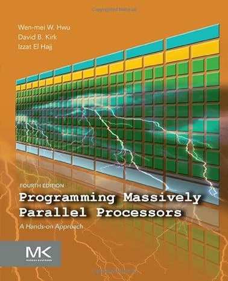

#### Wednesday, June 5, 2024

This folder will contain the code samples referenced in the book "Programming Massively Parallel Processors".

The Youtube channel [Programming Massively Parallel Processors](https://www.youtube.com/@pmpp-book) has 3 play-lists, all covering the same material but different times and lecturers. The playlist [AUB Spring 2021 El Hajj](https://www.youtube.com/playlist?list=PLRRuQYjFhpmubuwx-w8X964ofVkW1T8O4) is taught by Izzat El Hajj, who is one of the co-authors of the book. You should probably go with this. 

Searching on Github for 'ECE408' yields numerous hits, and I arbitrarily landed on [this](https://github.com/eedalong/ECE408). I can't seem to find any 'official' release of the code, probably because it is a course, and the University of Illinois would not publicly post the solutions to their course ... just guessing here. 