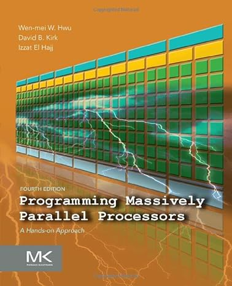
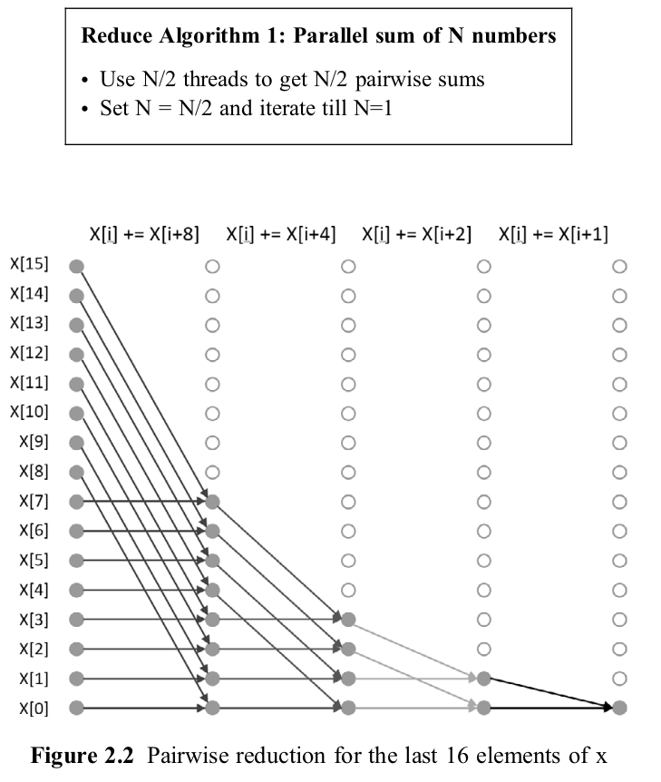

# CUDA
My CUDA learning journey.

## Monday, March 13, 2023

This journey begins with a walk through of the 'CUDA Training Series' by the OAK RIDGE National Laboratory. https://www.olcf.ornl.gov/cuda-training-series/

The repository for this course is found at https://github.com/olcf/cuda-training-series

The relevant code will be pulled from that repository into the CUDA-Training-Series folder of this repository.

All work will be done using Visual Studio Code. MAKE SURE you have the extension 'Nsight Visual Studio Code Edition' installed. It makes all the CUDA programming goodness available to you. 

10:50am The very first time you spin up this folder in Visual Studio Code, it will have no idea of what kind of environment this is (Python? C#? Java?), and so you need to tell it. This is done by creating a launch configuration file, and you can read about this here ...

https://docs.nvidia.com/nsight-visual-studio-code-edition/cuda-debugger/index.html

This doc will only work up to a point. You will create a tasks.json file but when you go to Run Build Task, it will fail because there is no Make file. At this point, I add in a Makefile to the work folder, modelled off of ...

https://github.com/PacktPublishing/Learn-CUDA-Programming/blob/master/Chapter01/01_cuda_introduction/02_vector_addition/Makefile

I plan on pulling in resources from this repository in the future. 

The primary take away is USE A MAKEFILE. The stuff in tasks.json just does not work. 

11:46am At this point, I have the code in /CUDA-Training-Series/hw1/matrix_mul_solution.cu running successfully with the cuda debugger. Nice!

Man, I like that! When I run 'git push origin main', I no longer have to submit my credentials every time. Visual Studio Code has saved that for me, and now it just works.

4:54pm Right now I am thinking to go through the CUDA Programming Guide as my primary resource. 

## Tuesday, March 14, 2023

Playing with smokeParticles and Mandelbrot of NVIDIA/cuda-samples/Samples/5_Domain_Specific. Both example folders were copied from /Data/Documents/Github/NVIDIA/cuda-samples/Samples. Dropping into the terminal of either folder and running 'make clean' and then 'make' is able to successfully compile the target example and then run them without problems. However, when I copy them from that folder into this repo, and do the same, it does not work. Running 'make' in either produces the same error:

>>> GCC Version is greater or equal to 5.0.0 <<<
/usr/local/cuda/bin/nvcc -ccbin g++ -I../../../Common -m64 --std=c++14 --threads 0 -gencode arch=compute_50,code=sm_50 -gencode arch=compute_52,code=sm_52 -gencode arch=compute_60,code=sm_60 -gencode arch=compute_61,code=sm_61 -gencode arch=compute_70,code=sm_70 -gencode arch=compute_75,code=sm_75 -gencode arch=compute_80,code=sm_80 -gencode arch=compute_86,code=sm_86 -gencode arch=compute_89,code=sm_89 -gencode arch=compute_90,code=sm_90 -gencode arch=compute_90,code=compute_90 -o GLSLProgram.o -c GLSLProgram.cpp
GLSLProgram.cpp:30:10: fatal error: helper_gl.h: No such file or directory
   30 | #include <helper_gl.h>
      |          ^~~~~~~~~~~~~
compilation terminated.
make: *** [Makefile:369: GLSLProgram.o] Error 255

So what exactly is going on here? Both examples have a ./vscode subfolder. 

Ah, ok. I think I see the problem. Looking at the .vscode/c_cpp_properties.json file of either one, there is a:

 "includePath": [
            "${workspaceFolder}/**",
            "${workspaceFolder}/../../../Common"
        ],

... which of course this repo does not have. So I am going to dump that in here, then try again. 

Ok, nice, that was the problem. They now both compile and run without any problems. 

Hmm I killed the .vscode sub folder in both folders, and I can still compile without any problems. Nice. I also noticed when I removed them, nothing changed when I ran 'git status' and that's probably because the '.' prefix in the name '.vscode' makes the folder hidden. 

10:37am As you continue to work through the NVIDIA cuda-samples, you will learn what to pay attention to as you read the code and run the examples. It's an iterative process that show's you all the CUDA stuff you have no idea about, as well as the quirks when running them in Visual Studio Code on Ubuntu. 

11:17am So I am actualy going to go back over the slides in the CUDA Training Series. 

12:19pm Meh Reading the CUDA C++ Programming Guide.

# Wednesday, March 15, 2023

Going through lesson 3 of the CUDA Training Series. In the video '3) CUDA Optimization (1 of 2)' start listening at round 40 minutes, which explains Launch Configuration. 'GPU Latency Hiding' begins around 51:30. (64 warps per multiprocessor maximum) Each warp is 32 threads. Instructiions are executed in groups of 32 threads, so they are issued warp by warp.

Wow. I have Github CoPilot running and it is amazing what it is able to generate. I am going to have to learn how to use it! 

I think I will opt to pay for it once this trial period is over.

It KNOWS I am writing CUDA code, and it is able to generate CUDA code for me. And it has generated some of these comments for me.! I am stunned at its predictive abilities.

# Thursday, March 16, 2023

Wow, did I ever waste a lot of time today. I was attempting to step through the CUDA-PROGRAMS/Chapter01/gpusum/gpusum.cu program in the "Programming in Parallel with CUDA' book using the repo I pulled down a few days ago. This repo was updated to work with CUDA 12.1. This example uses Thrust, which I have not yet used. After much messing with the makefile, I was able to compile the program, but when I ran it, it failed with the error when it tried to do the thrust call. After much dicking around, I eventually tried checking out that repo from the branch I created on '2022-06-11' and it worked. So I am going to go back to that branch and start from there. Damnit, I hate it when I waste time like that.

And once again, I am stunned at how good CoPilot is at generating these comments for me. I am going to have to learn how to use it!

8:29pm Hmm still getting some thrust run time issues, and I don't know why. I am going to have to look into this more tomorrow.

# Friday, March 17, 2023

Today I am going to try to resolve these thrust::device_vector issues I am having. I am going to start by going through the 'Programming in Parallel with CUDA' book, and see if I can get the gputiled1.cu program to work.

11:05am So yeah, I figured it out. In the Makefile, there was a compiler switch "-gencode arch=compute_86,code=sm_86" that was causing this problem. Remove that from the compile and link lines, and it works. Damn! I hate it when I waste time like that!

# Saturday, March 25, 2023

Continuing to work through various examples. I really need to be doing this on a daily basis. I am going to try to do this every day, even if it is just for a few minutes.

The trouble with 'just going through the NVIDIA samples' is the documentation is really sparse, and there is no real order in which to go through them. I am going to try to go through the CUDA Training Series, and then go through the NVIDIA samples.

Also, as you work through any of these examples, always finish up with a note of where you left off, so that when you come back to it, you know where to pick up.

# Thursday, April 6, 2023

Nice. My CoPilot trial has been cancelled, but it still works. 
Resuming with the NVIDIA samples. Loading in 2_Concepts_and_Techniques/particles

Remember to kill all the Visual Studio project and solution files. Terminal into the sample folder and run 'make clean' and then 'make'. The Makefile that came with the project works just fine! No need to tweak this file. 
To build the debug version, run 'make DEBUG=1'.

Hmm so when I run the debug version of the program, I can see 2 versions of the program from nvidia-smi. One is running on GPU 0 and takes up 18Mib, and the second is running on GPU 1 and takes up 206Mib.
Hmm so if I rebuild the program without the DEBUG=1 flag, I still see a version on each GPU, but on GPU 1, it now only takes up 124 MiB. 

The sample program histogram does not have any visual element. When I run it, it only runs on GPU 1.

# Monday, September 18, 2023

So today I decided I want to continue with learning CUDA. I tried to run some of the programs but then noticed I no longer have CUDA installed to KAUWITB. So I guess I need to reinstall it, so let's do that ... [NVIDIA CUDA Installation Guide for Linux](https://docs.nvidia.com/cuda/cuda-installation-guide-linux/index.html) This will install CUDA 12.2, which is the same version as the current CUDA driver.

And I cannot recall when I decided to kill CUDA from KAUWITB, but, clearly, it is no longer there. 

7:55pm Damn, did that take a long time to install. Issues the first couple of times but eventually got er going! We are back in business! Nice!

# Tuesday, September 19, 2023

9:58am I forgot to mention this from yesterday ... After installing CUDA, when I rebooted, I could no longer see anything on my 3 screens.The solution was to reboot with only 1 monitor connected. Then validate CUDA is working, and then reconnect the other 2 monitors. 

10:00am Today, I want to continue with "Programming in Parallel with CUDA - A Practical Guide" by Richard Ansorge. The idea is to establish the habit (again!) of daily coding and repo updates. 

10:25am Yup, back to these Thrust issues again ... with CUDA-Programs/Chapter01/gpusum.cu.

[Thrust Documentation](https://docs.nvidia.com/cuda/thrust/index.html)

[Thrust Github Repo](https://github.com/NVIDIA/thrust)

10:35am OK. So visually scanning the code from the current [repo](https://github.com/RichardAns/CUDA-Programs) reveals code specific to CUDA 12 ... so, I am going to grab that current code, and replace ALL the code in CUDA-Programs/include with this release ...

10:55am Nice! CUDA-Programs/Chapter01/gpusum.cu now runs without problems!

# Wednesday, September 20, 2023

9:26am Continuing with "Programming in Parallel with CUDA"

# Thursday, September 21, 2023

9:58am Continuing with "Programming in Parallel with CUDA"

# Tuesday, September 26, 2023

2:00pm Continuing with "Programming in Parallel with CUDA" ... got side tracked the last few days cuz its been soo nice outside and I had zero desire to sit inside and stare at a screen!

# Friday, January 5, 2024

Gonna crawl my way back into this learning path. Right away I noticed a lot of red squigglies when looking at /CUDA-Training-Series/hw3/vector_add_solution.cu ... suggesting this code does not know it's a cuda program ... ? 

Hmm I can hit F5, it runs, and the debugger runs ... so why all the red stuff?

The cuda stuff runs on the 4090, not the main display 1050 card ... why??

Right! I wanted to see if the CUDA Sample programs still ran on this computer, then remembered that code is now found locally at Data/Documents/Github/NVIDIA/cuda-samples 

OK. I was still able to run .... 

* /Data/Documents/Github/NVIDIA/cuda-samples/Samples/1_Utilities/deviceQuery
* /Data/Documents/Github/NVIDIA/cuda-samples/Samples/5_Domain_Specific/Mandelbrot
* /Data/Documents/Github/NVIDIA/cuda-samples/Samples/5_Domain_Specific/smokeParticles

Terminal into these folders, then run ./deviceQuery, to run the program ...

# Saturday, January 6, 2024

Those red squiggles were showing up because intellisense did not know where to find the cuda header files. I had to add the following to the top of the file ... 

* #include <cuda.h>
* #include <cuda_runtime.h>

That makes a lot of the red squiggles disappear, but not all of them ... meh.

# Thursday, May 16, 2024

Yup, giving this another go. 

Gonna give the book [Programming Massively Parallel Processors](https://www.amazon.ca/Programming-Massively-Parallel-Processors-Hands/dp/0323912311/?_encoding=UTF8&ref_=pd_hp_d_atf_ci_mcx_mr_hp_atf_m) a go ... 

* [Accelerated Computing Teaching Kit Lab/solution Repository](https://github.com/pixom-ai/NVIDIA-AcceleratedComputing)
* [Programming Massively Parallel Processors](https://www.youtube.com/@pmpp-book)

# Tuesday, May 21, 2024

* [Programming Massively Parallel Processors](https://www.youtube.com/watch?v=kwtn2NtFIuA&list=PLRRuQYjFhpmvu5ODQoY2l7D0ADgWEcYAX)

# Monday, May 27, 2024

Getting back to 'Programming in Parallel with CUDA' ... cuz reading a book keeps you focused and reduces the distractions, right ...

I kinda recall why I bailed on this book. I am using VSCode as my IDE and these code samples use a make file, which I have to tweak to get it right. I recall trying to 'learn how to make a make file' and got frustrated with the experience. Whelp, gonna try to learn enough to get past this problem.

Running 'make build NAME=11_cpusum' from within the CUDA-Programs/Chapter01 folder compiles without errors, but running 'make build NAME=13_gpusum' from within the same folder results in the following errors ... 

      (base) rob@KAUWITB:~/Data/Documents/Github/rkaunismaa/CUDA/CUDA-Programs/Chapter01$ make build NAME=13_gpusum
      /usr/local/cuda/bin/nvcc -ccbin g++ -I /home/rob/Data/Documents/Github/NVIDIA/cuda-samples/Common/ -I /home/rob/Data/Documents/Github/RichardAns/CUDA-Programs/include/ -g -G -m64  --threads 0 --use_fast_math  -o 13_gpusum.o -c 13_gpusum.cu
      13_gpusum.cu(1): warning #968-D: this universal character is not allowed in an identifier
      \U0000feff
      ^

      Remark: The warnings can be suppressed with "-diag-suppress <warning-number>"

      13_gpusum.cu(1): error: this declaration has no storage class or type specifier
      \U0000feff
      ^

      /usr/include/x86_64-linux-gnu/bits/stdint-uintn.h(24): error: expected a ";"
      typedef __uint8_t uint8_t;
      ^

      /usr/include/c++/11/cstdint(65): error: the global scope has no "uint8_t"
         using ::uint8_t;
                  ^

      /usr/local/cuda/bin/../targets/x86_64-linux/include/cuda/std/detail/libcxx/include/__type_traits/../cstdint(171): error: the global scope has no "uint8_t"
      using::uint8_t;
               ^

      /usr/include/c++/11/atomic(1111): error: identifier "uint8_t" is undefined
         typedef atomic<uint8_t> atomic_uint8_t;
                        ^

      /usr/local/cuda/bin/../targets/x86_64-linux/include/thrust/detail/cstdint.h(58): error: the global scope has no "uint8_t"
      typedef ::uint8_t uint8_t;
                  ^

      6 errors detected in the compilation of "13_gpusum.cu".
      make: *** [Makefile:42: 13_gpusum.o] Error 255

Looking at the original [RichardAns/CUDA-Programs](https://github.com/RichardAns/CUDA-Programs) reveals every program code file is in its own subfolder, whereas I am less granular copying the desired code samples in the 'CUDA-Programs/Chapter01', 'CUDA-Programs/Chapter01', etc folders. My cursory look at these make files suggests they are all the same.  

OK. I copied the original code samples into the 'CUDA-Programs/Chapter01/gpusum' folder and replicated the folder structure here. I also created a 'Linux' folder below 'CUDA-Programs' and made 3 path changes to the 'CUDA-Programs/Chapter01/gpusum/Makefile' file, then ran'make build NAME=gpusum' from within the 'CUDA-Programs/Chapter01/gpusum' folder ...It compiled just fine. 

Dammit, right! I remember the book refers to the 'CUDA-Programs/Chapter01/gpusum.cu' file as '13_gpusum.cu' ... I think this is why I was running into these stupid build errors. What an idiot! ... sigh. 

OK! 'CUDA-Programs/Chapter01/gpusum.cu' compiles with debugging just fine by running 'make debug NAME=gpusum' from within the 'CUDA-Programs/Chapter01/gpusum' folder. And then modify the 'launch.json' file to ...

   "program": "${workspaceFolder}/CUDA-Programs/Chapter01/gpusum/gpusum"

... and then you will be able to run the program through the debugger. 

So yeah, this is the workflow to get stuff going!

So now you would think I should be able to replicate 'CUDA-Programs/Chapter01/gpusum/gpusum.cu' to 'CUDA-Programs/Chapter01/gpusum.cu' and also 'CUDA-Programs/Chapter01/gpusum/Makefile' to 'CUDA-Programs/Chapter01/Makefile', then run 'make build NAME=gpusum' from within the 'CUDA-Programs/Chapter01' folder ... but nope. 

OK ... I renamed the original 'CUDA-Programs/Chapter01/13_gpusum.cu' to ''CUDA-Programs/Chapter01/_13_gpusum.cu', then renamed ''CUDA-Programs/Chapter01/gpusum.cu'' to 'CUDA-Programs/Chapter01/13_gpusum.cu', and tweaked the 'CUDA-Programs/Chapter01/Makefile' file from '../../Linux/' to '../Linux', and now stuff works! Great! ... Sigh ... yup, this is the workflow ... you gotta figure stuff out on your own!

# Tuesday, May 28, 2024

Damn the book 'Programming in Parallel with CUDA' is really good. Goes into a lot of detail. Interesting to realize [NVIDIA/Thrust](https://github.com/NVIDIA/thrust) is no longer being worked on as separate library but has been 'The Thrust repository has been archived and is now part of the unified nvidia/cccl repository' ...

# Wednesday, May 29, 2024

Continuing with "Programming in Parallel with CUDA" 

Why are my command line arguments defined in launch.json not being passed into the program??

OK! Got it to work! 

# Wednesday, June 5, 2024

Continuing with "Programming in Parallel with CUDA" 

The rank of the thread within its 3D thread block is calculated using the standard 3D addressing rank formula:

Another resource I plan on going through is [Programming Massively Parallel Processors (4th Edition)](https://www.amazon.ca/Programming-Massively-Parallel-Processors-Hands/dp/0323912311/?_encoding=UTF8&ref_=pd_hp_d_atf_ci_mcx_mr_ca_hp_atf_d)

# Sunday, June 9, 2024

Going to start running this code in the 'milvus' conda environment because I want to use opencv.

Whelp, went to run 'mamba install conda-forge::opencv' on milvus, and bailed cuz too much stuff would change and most likely break this environment. 

Looks like the conda environment 'hhgnnup' is a safer environment to install opencv to ... but yeah, hhgnnup is a python environment, so why am I even looking into this??

# Monday, June 10, 2024

Today I installed OpenCV to kauwitb using ... cuz why the hell not, right?

* sudo apt install libopencv-dev

# Tuesday, June 25, 2024

Last while has been spent on going through "Programming Massively Parallel Processors". Was starting to go through "Chapter 6, Performance Considerations" but then thought it may be better to go through the initial chapters of the book "Programming in Parallel with CUDA" so I am now gonna get back to that book, and see where I left off with this other excellent book.

# Thursday, June 27, 2024

"Programming in Parallel with CUDA", "Chapter 2 Thinking and Coding in Parallel" goes into great detail about different launch configurations and how to most affectively launch different kinds of applications. The knowledge in here is really worth getting a handle on ...

# Sunday, June 30, 2024

The book "Programming in Parallel with CUDA" has an excellent, detailed walk through of implementing the 'Parallel Reduce' algorithm, starting from page 40, '2.6 Parallel Reduce' ending on page 51. Study this stuff and learn it cold! This entire parallel reduction section is based on the excellent resource [Optimizing Parallel Reduction in CUDA](https://developer.download.nvidia.com/assets/cuda/files/reduction.pdf) which I have downloaded and saved into 'CUDA-Programs/Chapter02/Optimizing Parallel Reduction in CUDA.pdf'

The four 'reduce' sample programs in 'CUDA-Programs/Chapter02' demonstrate CUDA optimization techniques, which are summarized as:

1) 205_reduce0.cu => sum of 16777216 random numbers: host 8389645.1 415.011 ms, GPU 8389646.0 17.529 ms
2) 206_reduce1.cu => reduce1 config 288 256: sum of 16777216 numbers: host 8389645.1 422.307 ms GPU 8389645.0 0.293 ms
3) 207_reduce2.cu => sum of 16777216 numbers: host 8389645.1 423.552 ms GPU 8389645.0 0.214 ms
4) 208_reduce3.cu => sum of 16777216 numbers: host 8389645.1 411.263 ms GPU 8389645.0 0.198 ms
5) 209_reduce4.cu => sum of 16777216 numbers: host 8389645.1 402.027 ms GPU 8389645.0 0.169 ms

Notice the biggest improvement by far is from 205_reduce0 to 206_reduce1, but it makes me wonder if there is something wrong with the code in reduce0!

Whelp, to answer that question, I grabbed the original source code from the [repo](https://github.com/RichardAns/CUDA-Programs/tree/main/Chapter02) into reduce0.cu and reduce1.cu, used the same make file to compile and run each and got this ...

1) reduce=> sum of 16777216 random numbers: host 8389645.1 401.184 ms, GPU 8389646.0 0.236 ms
2) reduce=> reduce1 config 288 256: sum of 16777216 numbers: host 8389645.1 402.904 ms GPU 8389645.0 0.233 ms

Hmmm ... close ... so let's again run 205_reduce0 ... 

3) 205_reduce0 => sum of 16777216 random numbers: host 8389645.1 401.115 ms, GPU 8389646.0 0.233 ms

All three were run from the terminal prompt, NOT IN DEBUG MORE INSIDE OF VSCODE!

Running 205_reduce0 3 times in debug mode inside of VSCode produces ...

* sum of 16777216 random numbers: host 8389645.1 400.497 ms, GPU 8389646.0 18.804 ms
* sum of 16777216 random numbers: host 8389645.1 397.713 ms, GPU 8389646.0 17.609 ms
* sum of 16777216 random numbers: host 8389645.1 401.838 ms, GPU 8389646.0 17.757 ms

Conclusion? Yeah, there is a performance difference when running the program from the terminal versus running in debug mode inside of VSCode! 

Hmmm running 206_reduce1 from the terminal versus inside of VSCode in debug mode:

* terminal =====> reduce1 config 288 256: sum of 16777216 numbers: host 8389645.1 400.801 ms GPU 8389645.0 0.238 ms
* VSCode debug => reduce1 config 288 256: sum of 16777216 numbers: host 8389645.1 400.271 ms GPU 8389645.0 0.244 ms

Hmmm retest running 205_reduce0 from the terminal versus inside of VSCode in debug mode:

* terminal =====> sum of 16777216 random numbers: host 8389645.1 401.088 ms, GPU 8389646.0 0.232 ms
* VSCode debug => sum of 16777216 random numbers: host 8389645.1 400.599 ms, GPU 8389646.0 17.285 ms

WHY IS THERE SUCH A BLOODY DIFFERENCE IN RUN TIMES???

HMM run reduce0 in VSCode debug mode ...

* sum of 16777216 random numbers: host 8389645.1 400.368 ms, GPU 8389646.0 17.987 ms

Yup! Same difference in performance! WHY??

This seems to boil down to identifying the differences in the code between reduce0 and reduce1, right? .. 

And why can't I successfully compile the cpp programs using the make file from the repo??

# Monday, July 1, 2024

Continuing to drill through the most excellent book "Programming in Parallel with CUDA".

Got the cpp stuff compiling and running ... sigh. 

# Thursday, July 4, 2024

Last while has been on "Programming in Parallel with CUDA" but now I want to get back to "Programming Massively Parallel Processors" because I feel kinda stuck with the first book and want to regroup and re-read the stuff I have already gone over in the second book and figure out next steps. 

"Chapter 1: Introduction" can be skimmed over ... the meatier stuff starts with "Chapter 2: Heterogeneous data parallel computing".

Damn. The code generated by ChatGPT continues to amaze me! ... Super helpful to have this as I work through the book, cuz, remember, there is no associated repository. 

The following was from ChatGPT ...

Understanding the NVIDIA GeForce RTX 4090 Architecture
The RTX 4090 is based on the Ada Lovelace architecture and offers the following characteristics:

CUDA Cores: 16,384
Memory: 24 GB GDDR6X
Base Clock: 2.23 GHz
Boost Clock: 2.52 GHz
L2 Cache: 72 MB
SM Count: 128 Streaming Multiprocessors (SMs)
Warp Size: 32 threads

I also asked [Create a spreadsheet that displays the differences between a NVIDIA RTX 2070 Super and a 4090 gpu.](https://chatgpt.com/c/a768e672-74c0-496b-91c1-c3a0b870901f) and got RTX_2070_Super_vs_RTX_4090.xlsx. I then asked "Also include the 1050", and got GTX_1050_vs_RTX_2070_Super_vs_RTX_4090.xlsx.

# Wednesday, July 10, 2024

Moving onto 'Chapter 6 - Performance considerations' of the book 'Programming Massively Parallel Processors'.

# Friday, July 12, 2024

[Intro to Parallel Programming CUDA - Udacity 458](https://www.youtube.com/playlist?list=PLnH7E0IG44jFfiQBd_Ov7FmYHq8SZx6r0)

[2D tiled convolution example by Claude](https://claude.ai/chat/f21125f2-40a4-4bf1-a799-6be5cc4694c7)

Dumped in the NVIDIA cuda samples 'convolutionSeparable' code sample into this repo and was able to compile and run the code. 

Hmmm that convolutionSeparable folder came with its own .vscode folder. How to I get the debugger to use that instead of the root .vscode folder?? I want to step through the code using the "Nsight Visual Studio Code Edition" plugin ... 

Tried a simple hack ... rename the root '.vscode' folder to '_.vscode' then hit F5 when in the main.cpp program. VSCode generated a new root '.vscode' folder and asked a few things, I selected some defaults, but it did not run the code ... meh ... may look into this later.

# Tuesday, August 27, 2024

Yup, getting back to CUDA, just cuz I still think this is worth knowing and REALLY understanding ... 

Tried compiling "Massively-Parallel/Chapter05/tiledMatrixMultiplication_Claude_2.cu" by running 'make' from a terminal in that folder, and got errors about opencv-4 missing! ... fack. 

Previous notes mentions running "sudo apt install libopencv-dev" to install opencv ... gonna look into opencv on KAUWITB ... 

OK ... got it to run. Nice. 
